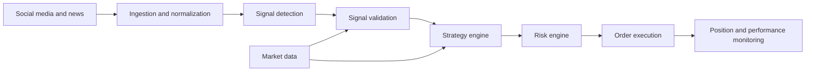
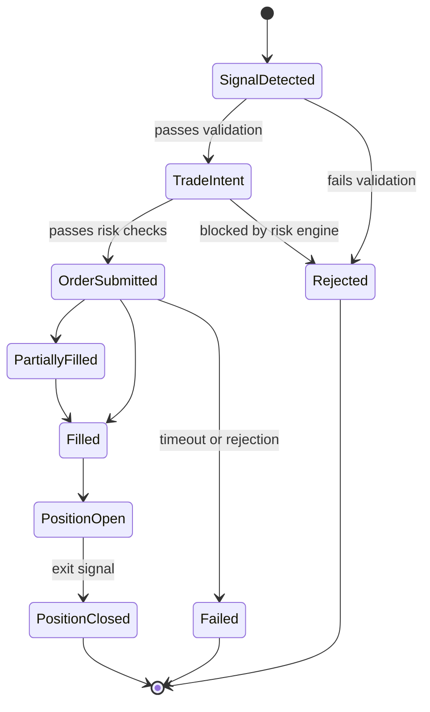

# Social Signal Trading Bot

**An event-driven crypto trading bot that turns real-time social media and news signals into validated, risk-checked token trades.**

<!-- Replace <owner>/<repo> with your GitHub path. Remove badges you don't want. -->


Social Signal Trading Bot monitors social platforms such as X (Twitter) and news sources for market-moving events, checks each signal against live market conditions (price, volume, liquidity, slippage), and, when the strategy and risk limits allow, submits automated buy and sell orders.

It is built as a modular, low-latency pipeline:

**social monitoring → signal detection → market validation → strategy → risk management → order execution → position tracking**

> [!NOTE]
> **Project status: early development.** The architecture described here is the design target. See the [Roadmap](#roadmap) for what is implemented. Use paper trading before any live execution.

## Table of Contents

- [What is a social signal trading bot?](#what-is-a-social-signal-trading-bot)
- [Key features](#key-features)
- [How it works](#how-it-works)
- [Signal detection and validation](#signal-detection-and-validation)
- [Strategy and risk management](#strategy-and-risk-management)
- [Order execution and position management](#order-execution-and-position-management)
- [Latency measurement](#latency-measurement)
- [Reliability and observability](#reliability-and-observability)
- [Backtesting and paper trading](#backtesting-and-paper-trading)
- [Technology stack](#technology-stack)
- [Project structure](#project-structure)
- [Getting started](#getting-started)
- [Security and responsible use](#security-and-responsible-use)
- [Frequently asked questions](#frequently-asked-questions)
- [Roadmap](#roadmap)
- [Contributing](#contributing)
- [Disclaimer](#disclaimer)
- [License](#license)

## What is a social signal trading bot?

A **social signal trading bot** is an automated trading system that monitors social media, news, and other information sources for events that may influence markets, then combines those events with real-time market data to make trading decisions.

Traditional trading bots rely mainly on price, volume, order books, and technical indicators. A social signal trading bot adds an information layer: a new announcement from a tracked project or influential account is detected, classified, and compared with current liquidity, price movement, and volume *before* a trading decision is made.

Detecting a post is the easy part. A reliable system also has to handle duplicate events, stale market data, latency, position sizing, slippage, API failures, rate limits, partial fills, position reconciliation, and observability.

**Design goal:** how quickly and reliably can an automated system transform an external information event into a validated trading decision and measurable execution?

## Key features

- **Real-time social and news monitoring**: track accounts, keywords, token symbols, project names, exchange announcements, protocol updates, and breaking news.
- **Structured signal detection**: normalize raw events, detect entities, classify event types, and generate trading signals that filter out general social-media noise.
- **Market signal validation**: a social event never becomes a trade automatically. Signals are checked against price, momentum, volume, liquidity, spread, volatility, market depth, onchain activity, and existing exposure.
- **Pluggable strategy engine**: strategy logic is separated from data ingestion and exchange integration, so strategies can be tested without rewriting execution code.
- **Independent risk engine**: position limits, loss limits, slippage limits, cooldowns, and an emergency shutdown, enforced outside individual strategies.
- **Automated buy and sell execution**: order status tracking, timeouts, retries, rejected orders, partial fills, slippage measurement, and reconciliation.
- **End-to-end latency measurement**: timestamps at every pipeline stage make reaction time measurable instead of assumed.
- **Backtesting and paper trading**: evaluate signals and strategies on historical or live data without sending real orders.
- **Observability**: metrics and structured logs that connect the original social event to the resulting trade.

## How it works

The system is event-driven: each stage runs independently and communicates through typed events. This makes it easier to scale components, process events asynchronously, isolate failures, replay historical events, and add new strategies.



| Event | Produced by | Meaning |
| --- | --- | --- |
| `SocialEvent` | Ingestion | A normalized post, announcement, or news item |
| `SignalEvent` | Signal detection | A structured, classified trading signal |
| `ValidatedSignal` | Signal validation | A signal confirmed against market conditions |
| `TradeIntent` | Strategy engine | A BUY, SELL, HOLD, or IGNORE decision |
| `OrderRequest` | Risk engine | A risk-approved order sent to execution |
| `OrderUpdate` | Execution | Order status changes and fills |
| `PositionUpdate` | Position manager | Updated exposure, entry, and PnL |

### Example end-to-end flow

1. A tracked account publishes a market-relevant announcement.
2. The event is received and normalized.
3. The relevant token is identified and a signal is generated.
4. Liquidity, spread, volume, and price momentum are checked.
5. The strategy evaluates the validated signal and emits a `TradeIntent`.
6. The risk engine checks position size, exposure, cooldowns, and loss limits.
7. The order is submitted and execution is confirmed.
8. The position is updated and every stage timestamp is recorded for analysis.

## Signal detection and validation

**Detection** converts raw events into structured signals:

`raw event → normalization → entity detection → event classification → signal generation`

**Validation** compares each signal with real-time market conditions before it can reach the strategy:

- token price and price momentum
- trading volume and liquidity
- spread and market depth
- volatility
- onchain activity
- existing exposure in the same token

Duplicate-signal protection and stale-data checks apply at this stage as well.

## Strategy and risk management

A strategy receives **market state + social signal + portfolio state + risk state** and returns a `TradeIntent` (`BUY`, `SELL`, `HOLD`, or `IGNORE`). Strategies can expose configurable confidence thresholds, entry and exit conditions, position sizing, cooldown periods, liquidity requirements, and slippage limits.

Automated trading requires explicit risk controls, enforced independently of strategy code where possible:

| Control | Purpose |
| --- | --- |
| Maximum position size | Cap exposure to any single token |
| Maximum portfolio exposure | Cap total capital at risk |
| Maximum daily loss | Stop trading after a defined drawdown |
| Maximum trade frequency | Prevent runaway order loops |
| Minimum liquidity | Avoid tokens that cannot be exited |
| Maximum slippage | Reject trades with poor expected execution |
| Stale-market-data protection | Block decisions based on outdated prices |
| Duplicate-signal protection | Avoid trading the same event twice |
| Cooldown periods | Limit repeated entries in the same token |
| Execution timeouts | Cancel or resolve orders that hang |
| Emergency shutdown | Halt all trading immediately |

## Order execution and position management

The execution subsystem treats an order as a lifecycle to observe and recover, not a single API call. It handles buy and sell orders, status polling, confirmation, timeouts, retries, rejections, partial fills, slippage, and reconciliation.



Tracked position data includes entry and exit price, quantity, exposure, realized and unrealized PnL, fees, slippage, order status, and execution timestamps.

## Latency measurement

Reaction time is a core engineering concern for event-driven trading systems. Timestamps are recorded at each stage so latency can be measured per segment and end to end:

```text
source_timestamp → received_timestamp → processed_timestamp → signal_timestamp
→ decision_timestamp → order_submitted_timestamp → execution_timestamp
```

| Segment | Measured from → to |
| --- | --- |
| Source to ingestion | `source_timestamp` → `received_timestamp` |
| Normalization | `received_timestamp` → `processed_timestamp` |
| Signal processing | `processed_timestamp` → `signal_timestamp` |
| Decision | `signal_timestamp` → `decision_timestamp` |
| Order submission | `decision_timestamp` → `order_submitted_timestamp` |
| Execution | `order_submitted_timestamp` → `execution_timestamp` |
| **Total reaction time** | `source_timestamp` → `execution_timestamp` |

Measurements are persisted for later performance analysis. No latency benchmarks are claimed yet; results will be published once measured on real infrastructure.

## Reliability and observability

Real-time trading systems must assume external dependencies fail. The design accounts for network failures, API errors, rate limits, delayed, duplicate, or missing events, stale market data, rejected orders, partial fills, and process restarts.

Planned reliability mechanisms: idempotent event processing, retries with backoff, timeouts, circuit breakers, persistent state, health checks, reconciliation, structured logging, and metrics.

A trading system should make it possible to understand **why a trade happened**. Planned metrics:

```text
signals_detected_total        signals_validated_total       signals_rejected_total
trades_triggered_total        orders_submitted_total        orders_filled_total
orders_failed_total           signal_processing_latency_ms  decision_latency_ms
execution_latency_ms          realized_pnl                  unrealized_pnl
slippage_bps
```

Structured event logs link the originating social event to the resulting trade:

```text
[signal]    source=x account=tracked_account event=token_announcement
[market]    token=XYZ price=... volume=... liquidity=...
[strategy]  action=BUY confidence=...
[execution] order_id=... status=FILLED
```

## Backtesting and paper trading

**Backtesting** replays historical social events against historical market data: signal reconstruction → strategy simulation → execution simulation → performance analysis. Planned metrics include win rate, average return, maximum drawdown, Sharpe ratio, trade frequency, slippage, execution latency, signal-to-trade conversion, and false-positive rate.

**Paper trading** runs the full live pipeline (live signal → strategy → risk engine → simulated execution → simulated position) without sending real orders. Validate every strategy in paper mode before enabling live execution.

## Technology stack

The stack is planned and may evolve as the project develops.

| Component | Technology | Role |
| --- | --- | --- |
| Latency-sensitive services | Rust | Concurrent, high-performance ingestion and execution |
| Research and strategy | Python | Analytics, data processing, strategy development |
| Real-time data | WebSockets | Streaming market and social data |
| Integrations | REST APIs | External service and exchange access |
| Persistence | PostgreSQL | Events, trades, and positions |
| State and caching | Redis | Low-latency state |
| Messaging | Message queues / event streams | Asynchronous event processing |
| Deployment | Docker | Reproducible environments |

## Project structure

Planned layout:

```text
social-signal-trading-bot/
├── ingestion/        # social, news, and market-data connectors
├── signals/          # detection, classification, validation
├── strategy/         # strategies, risk engine, position sizing
├── execution/        # orders, exchange integration, reconciliation
├── storage/          # persistence layer
├── monitoring/       # metrics, logging, health checks
├── backtesting/      # historical replay and simulation
└── tests/
```

## Getting started

Runnable setup instructions will be added once the first end-to-end milestone (ingestion → signal → paper execution) is complete. Watch or star the repository to follow progress.

<!--
TODO: replace this section with real instructions, for example:
- Prerequisites (language toolchain versions, Docker, database)
- Installation
- Configuration (.env.example, tracked accounts, strategy settings)
- Running in paper-trading mode
- Running tests
-->

## Security and responsible use

- **Start in paper trading or on a testnet.** Never begin with live funds.
- **Use dedicated API keys** with trading-only permissions. Disable withdrawals and restrict by IP where the exchange supports it.
- **Never commit secrets.** Load keys from environment variables or a secrets manager.
- **Use a dedicated wallet** for onchain trading, funded only with money you can afford to lose.
- **Respect data-provider terms of service and rate limits** for every social and news source you connect.
- **Follow local laws and regulations**, including any rules on automated trading and market manipulation.

## Frequently asked questions

**What is a social signal trading bot?**
An automated trading system that detects market-relevant events on social media and news sources and combines them with real-time market data to make trading decisions.

**Is this an X (Twitter) trading bot?**
X is one of the target signal sources, alongside news and other feeds. The architecture is source-agnostic: any source can be added by implementing an ingestion connector that emits normalized events.

**Does it trade automatically?**
It is designed to generate trade intents and pass them through a risk engine to an execution layer. Paper trading is the intended default before live execution.

**Can it guarantee profits?**
No. Social signals can be wrong, manipulated, or delayed, and execution can differ from expected prices. Automated trading can lose money.

**Which exchanges and chains are supported?**
Not yet decided. The execution layer is separated from strategy logic so exchange and chain integrations can be added independently.

**Can I test strategies without real money?**
Backtesting and paper trading are on the roadmap for exactly this purpose.

## Roadmap

**Phase 1: Ingestion and signals**
- [ ] Social event ingestion
- [ ] News ingestion
- [ ] Event normalization
- [ ] Account monitoring
- [ ] Signal detection
- [ ] Signal classification

**Phase 2: Market data and strategy**
- [ ] Market-data integration
- [ ] Signal validation
- [ ] Strategy engine
- [ ] Risk engine
- [ ] Position sizing

**Phase 3: Execution**
- [ ] Paper trading
- [ ] Order execution
- [ ] Position management
- [ ] Event persistence

**Phase 4: Measurement and research**
- [ ] Latency measurement
- [ ] Observability
- [ ] Backtesting

**Phase 5: Production**
- [ ] Production deployment

## Contributing

Issues, ideas, and pull requests are welcome. Please open an issue to discuss significant changes before submitting a pull request.

## Disclaimer

> [!WARNING]
> This project is intended for software engineering, research, and educational purposes.
>
> Automated trading involves financial risk, including the loss of all invested capital. Social signals may be incorrect, manipulated, delayed, or unavailable. Market conditions can change rapidly, and actual execution may differ from expected prices. Past or simulated performance does not indicate future results.
>
> Nothing in this repository constitutes financial advice or a recommendation to buy or sell any asset.

## License

See [LICENSE](LICENSE) for license information.
